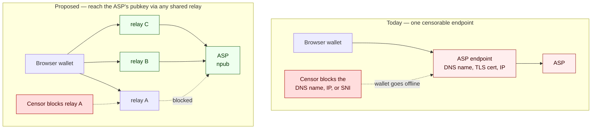
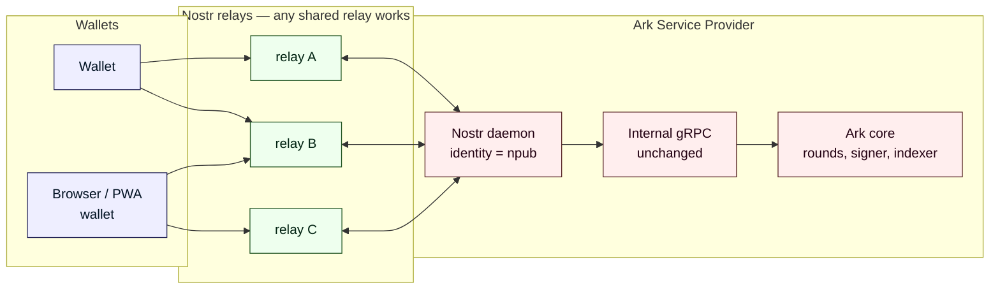

# Nostr as Ark Transport

**Keeping Bitcoin/Ark wallets reachable from censored networks — over Nostr, from a plain browser.**

*Design proposal · draft for discussion · open source ([MIT](LICENSE)).*

> **TL;DR** — An Ark wallet reaches its service provider (an *ASP*) over gRPC on a TLS
> endpoint: a DNS name, a certificate, an IP. Every one of those is censorable at the network
> edge, before any Bitcoin logic ever runs. This package designs an alternative transport over
> **Nostr** that collapses an ASP's network identity down to a single **pubkey**, reachable
> through any relay both sides share — including from a browser or PWA, where Tor cannot run.
> It is **connection portability only**: a wallet reaches the ASP it already chose, from any
> network. It changes nothing about custody, balances, or who holds what. Written from a country
> where this is daily life.

---

## The problem

Where I live, X was blocked for seven months, and most platforms became
reachable only through VPNs that were themselves blocked intermittently. The lived reality of
censorship is not "the service is down." It is a moving target: one transport works today, the
workaround works next week, and the workaround for the workaround works the week after.
Censorship-resistant payments matter most to exactly the people sitting behind that kind of
network — and the place the gap bites hardest is the **browser and PWA wallet**, the
lowest-friction way a new user touches Bitcoin at all.

Ark today reaches wallets the same way any ordinary web service does, and inherits the same
weakness. Concretely, an ASP is a `(DNS name, TLS certificate, IP)` tuple, and each part is a
chokepoint a network operator or a state can squeeze:

* **DNS is blockable.** A resolver can refuse to answer for the ASP's domain, or hand back a
  poisoned address. This is the cheapest and most common form of censorship, and it happens
  upstream of the ASP entirely.
* **IP and SNI are blockable.** Even with the address hardcoded, deep packet inspection reads
  the server name straight out of the TLS handshake (SNI is sent in the clear) and drops the
  connection on a match.
* **The endpoint is a single pinned identity.** A wallet holds one long-lived gRPC stream to one
  host. Block that host and the wallet is simply offline — there is no second door.

So the question this package answers is narrow: **can we reduce an ASP's network identity to
something with no DNS name and no fixed TLS endpoint to block, and still reach it from a
browser?**

## Today vs. what this proposes

Today, blocking the one endpoint takes the wallet offline. With a Nostr transport, the ASP's
identity is a pubkey; if one relay is blocked the wallet switches to another, and the ASP changes
nothing. **Censorship has to chase the relay, not the ASP.**

## What this proposes

Reduce the ASP's network identity to a **Nostr pubkey (npub)**, and exchange requests and
responses as small signed Nostr events on relays both parties share. A wallet pins the ASP's
npub the way it pins a TLS certificate today, and reaches it through *any* mutually supported
relay — over a plain browser WebSocket, with no SOCKS5, no bundled transport, and no native code.

**This is connection portability, full stop.** It does **not** move balances or state between
ASPs. Ark is a service model, not a federated network: a VTXO is a claim against one ASP's UTXO
and is redeemable only there. Any use of "portability" here means *a wallet can reach the ASP it
already chose, from any network* — never moving value across operators. (Full goals and non-goals:
[design.md §2](design.md).)

### Why Nostr is the right fit

Nostr is, at its core, a network of dumb relays that accept and forward small signed events, with
mature browser client libraries and an existing population of public relays. That maps onto the
transport problem almost exactly:

* **The ASP's identity collapses to a pubkey, not a hostname.** No DNS name to poison, no SNI to
  match.
* **It is reachable from a browser with no custom networking stack.** Relays speak WebSocket,
  which every browser and PWA already has. This is the property Tor cannot give the browser case.
* **Censorship routes around the relay, not the ASP.** Block one relay and the wallet switches
  to another; the single-pinned-endpoint failure mode goes away.
* **The crypto is already browser-shaped.** [NIP-44](https://github.com/nostr-protocol/nips/blob/master/44.md)
  encryption is ECDH + ChaCha20, audited by Cure53, and faster than AES-GCM in pure JS — exactly
  the budget a web wallet has.
* **There is direct prior art.** [NIP-47](https://github.com/nostr-protocol/nips/blob/master/47.md)
  (Nostr Wallet Connect), NIP-46 (remote signing), and NIP-90 (Data Vending Machines) already do
  request/response RPC over Nostr. This proposal is modelled on NIP-47, not invented from scratch.
* **It is method-agnostic.** The Nostr layer standardises only how messages *flow* (connection,
  encryption, correlation, streaming, discovery). Ark's two implementations keep their own method
  names — the way LND and Core Lightning each expose their own client API and a multi-wallet ships
  two adapters.

*Side benefit beyond censorship:* decoupling wallets from a fixed gRPC endpoint also lets an ASP
scale horizontally. Routing traffic through relays removes the connection-level pinning that
long-lived gRPC streams create, so an ASP can fail over or scale across datacenters without
forcing every wallet to reconnect.

### Why not the obvious alternatives

| Approach | Why it doesn't fit |
|---|---|
| **Domain fronting / CDN tricks** | Worked for a while, then the major CDNs disabled it under state pressure. A tactic with an expiry date, not a protocol property — and it puts a third-party intermediary in the request path. |
| **Tor onion services** | Genuinely solve censorship for the threat model they cover, but **browsers cannot run Tor** — a web wallet cannot open a SOCKS5 connection to the Tor network from inside a page. So Tor helps native desktop/mobile and does nothing for the browser/PWA user in a censored network, who is exactly the person I keep coming back to. Complementary, not a substitute: a user can still route the underlying connection through Tor independent of whether the wire is gRPC or Nostr. |
| **A bespoke Ark relay / mixnet** | Reinventing Nostr with a smaller network, no existing relay operators, no browser client libraries, and all the bootstrapping cost that implies. |

## How it works

Wallets and the ASP talk only through Nostr relays; neither side connects to the other directly.
The ASP runs a thin Nostr daemon in front of its existing internal gRPC and Ark core — nothing
about custody or the on-chain protocol changes.

The four primitives — discovery, unary RPC, server-streaming RPC, and long-poll — are worked out
in detail in the design doc, and three step-by-step sequence diagrams trace the wire:

* **[A single request and response](diagrams/sequence-request-response.md)** — the simplest unary
  call (`GetInfo`), end to end.
* **[A long-lived streaming subscription](diagrams/sequence-streaming.md)** — round events, with
  disconnect/reconnect and backfill.
* **[First-contact discovery](diagrams/sequence-discovery.md)** — how a wallet learns an ASP's
  identity and relay set from an `ark+nostr://` URI.

## What's in this package

| File | What it contains |
|---|---|
| **[design.md](design.md)** | The full technical design: the complete RPC surface of **both** Ark implementations — `arkd` (Go) and `bark` (Rust) — five open design questions presented with options, a method-by-method mapping onto Nostr, and security + performance analysis. |
| **[nip-draft.md](nip-draft.md)** | A draft NIP modelled on NIP-47, implementable as-is: four event kinds (request, response, stream, info), NIP-44 encryption, a standard error-code table, and an `ark+nostr://` onboarding URI. It picks one option for each open question so a developer can build directly from the spec. |
| **[diagrams/](diagrams/)** | The topology diagram plus the three sequence diagrams linked above. |

## Status and roadmap

**Status:** the design is complete and internally consistent — a *draft for discussion*,
pre-implementation. It is a **snapshot** pinned to specific upstream commits (see the drift
warning below), and it is honest about its own limits (next section).

The path from here, roughly in order:

1. **Circulate the design** with the Ark implementation teams and the Nostr community for review.
2. **Open a NIP PR** against `nostr-protocol/nips` for kind allocation and spec review.
3. **Build a reference implementation** — a Nostr daemon adapter in front of `arkd` and `bark`,
   running alongside the existing gRPC surface for at least one release cycle.
4. **Integrate a browser/PWA wallet** so users on censored networks can actually reach an ASP
   from a page — the whole point.

Steps 1–2 are next; 3–4 are where the design turns into something a person behind a blocked
network can use.

## Honest limitations

This raises the cost of censorship over a single TLS endpoint; it does not claim to eliminate it.
The candor here is deliberate — the full treatment is in [design.md §7–§9](design.md):

* **The relay is a partial adversary.** Even with NIP-44 encryption, a relay still sees that
  pubkey X talks to ASP Y, with timing and volume. It can withhold or reorder messages.
  Mitigations: publish to multiple relays; an optional gift-wrap mode hides the relationship.
* **Cold start when *every* known relay is blocked.** NIP-65 lets a wallet rotate among relays it
  already knows, but if all of them are blocked at once, recovery falls back to out-of-band
  channels (a fresh address shared by the ASP or a friend). Nostr does not fully solve this.
* **First-contact trust.** Nostr has no PKI equivalent of TLS's CA chain. The wallet trusts the
  channel that first delivered the npub and pins it. Three candidate hardening approaches are laid
  out; none is silently assumed.
* **Bounded, not absolute.** Following the NWC precedent, the realistic deployment is an ASP- or
  partner-operated relay set, not "all of Nostr." That is still far faster to rotate than a TLS
  endpoint (one signed event vs. DNS + cert + redeploy), but the censorship-resistance claim is
  meaningful *and* bounded.

## Maintainer

> **Dunsin** — `dunsin@getalby.com` (NIP-05)
>
> *I build in the Lightning and Nostr ecosystem. I've rewritten and implemented much of the Nostr
> layer across [Alby](https://getalby.com)'s tooling, did Summer of Bitcoin at Alby, i'm a finalist
> in Bitcoin Open Source Software 2026 (BOSS 2026), and have deep working knowledge of cryptography.
> Alongside that I'm an open-source contributor to [Arkade](https://github.com/arkade-os)'s
> implementation of the Ark protocol, with merged and in-review work across `arkd` (the Go server),
> the Go and TypeScript SDKs, and the Arkade Wallet — touching exactly the parts this proposal
> builds on: server-side intent and event handling, scheduled-task durability, and SDK connection
> resilience. I already have a working proof of concept where `arkd` holds a persistent Nostr
> identity, subscribes to a relay on startup, and round-trips a `get_info` call over Nostr on
> regtest. So I'm building from a codebase and a transport I already know end-to-end, not from
> scratch.*

## Snapshot and drift warning

The analysis is a snapshot. It was captured against `arkd` at commit `f8aefab4` (May 11 2026),
`bark` at `3de34bba` (May 13 2026), and the NIPs repo at `05d3f19` (April 28 2026). The protos,
method names, and streaming event vocabulary are the parts most likely to drift, so the tables in
[design.md §1.1 and §5](design.md) should be re-verified against the current state of those repos
before anything goes out for formal review.

## License

Released under the [MIT License](LICENSE). Free to use, modify, and distribute; this is an open
design and is meant to be built on.
