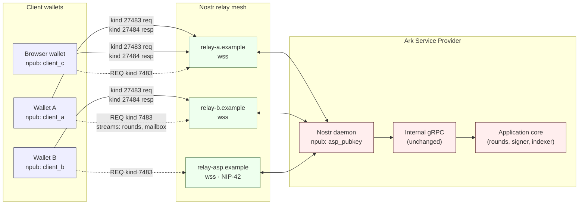

# Architecture

Topology: client wallets, the relay mesh, and one Ark Service Provider, with pubkey identities labelled. The ASP's network identity is its npub. Wallets and the ASP talk only through Nostr relays; neither side connects to the other directly.

Solid arrows are request and response (ephemeral kinds 27483 and 27484). Dashed arrows are long lived stream subscriptions (regular kind 7483). The ASP operated relay shown here is optional; in the recommended deployment the ASP advertises a relay set via NIP 65 and clients pick from it.

The diagram shows wallets reaching **one** ASP. Each ASP is a discrete liquidity island holding its own on chain capital. A wallet does not roam between ASPs the way a Lightning node routes through peers, and nothing in this transport tries to enable that. A wallet that wants to use multiple ASPs maintains a separate connection record (npub plus relay set) per ASP and treats each balance independently.
