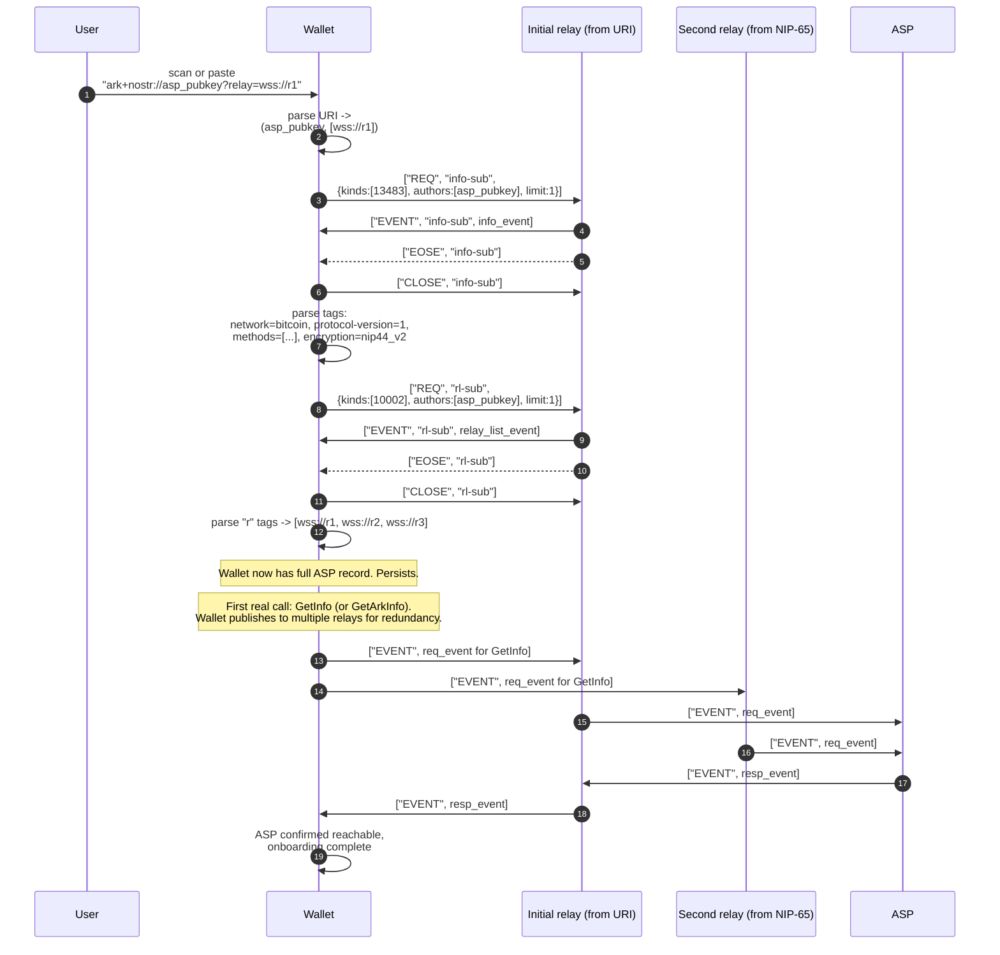

# Sequence: wallet learns an ASP's identity for the first time

A user adds an ASP to their wallet. The wallet receives an `ark+nostr://` URI (scanned, pasted, or deep linked), uses it to fetch the ASP's kind 13483 info event and kind 10002 NIP 65 relay list, validates network and protocol compatibility, and stores the resulting `(asp_pubkey, relay_set, capabilities)` tuple for later calls.

Trust posture: the wallet trusts whatever channel delivered the URI. The kind 13483 info event is signed by the ASP's pubkey, so the wallet can confirm the relay didn't fabricate it. The wallet cannot, from Nostr alone, confirm that the npub belongs to the real world ASP the user thinks it does. A NIP 05 verifier file (`/.well-known/nostr.json` on a known domain) can carry an additional human readable bind, but that is out of scope for the core transport.
