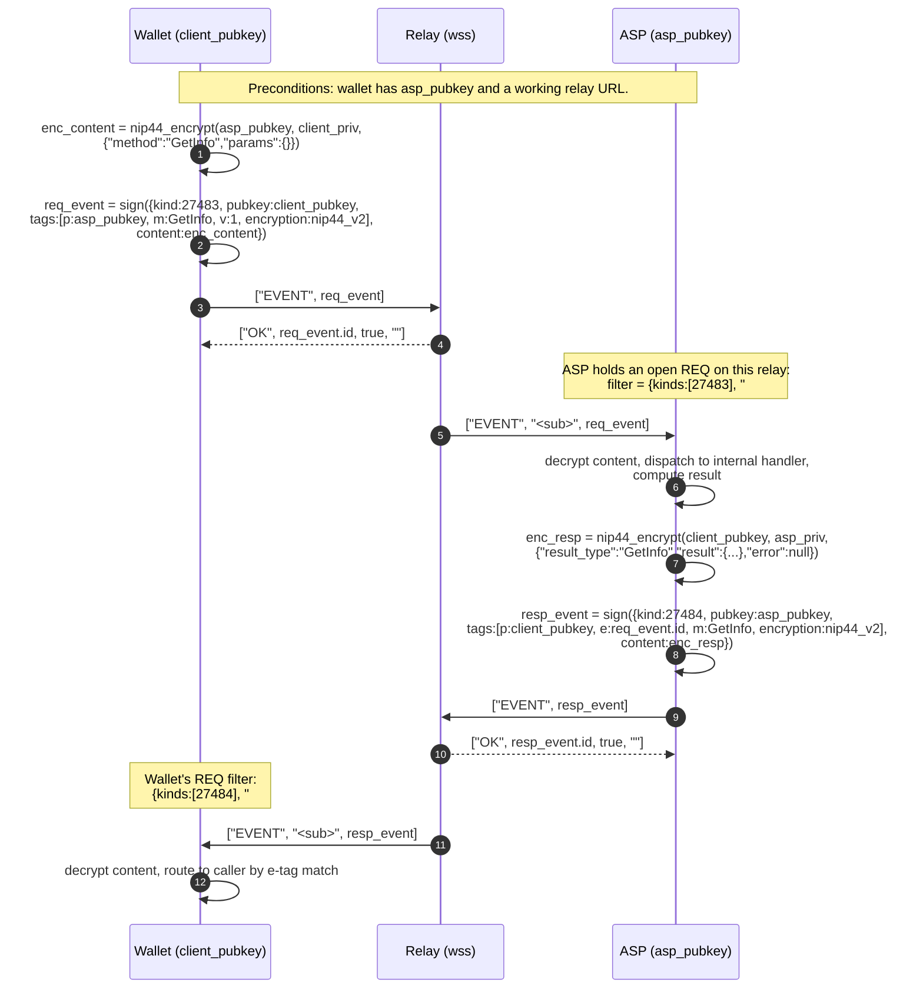

# Sequence: single request and response RPC

`GetInfo` on arkd or `GetArkInfo` on bark, the simplest in scope unary RPC. The client publishes one ephemeral request event tagged to the ASP's pubkey. The ASP filters for matching events on its relay set, decrypts, processes, and publishes an ephemeral response event tagged back to the client. Correlation is by `e` tag pointing at the request event id.

In a multi relay setup the wallet publishes the request to N relays in parallel. The response arrives from whichever relay the ASP saw first. The wallet deduplicates by event id.
